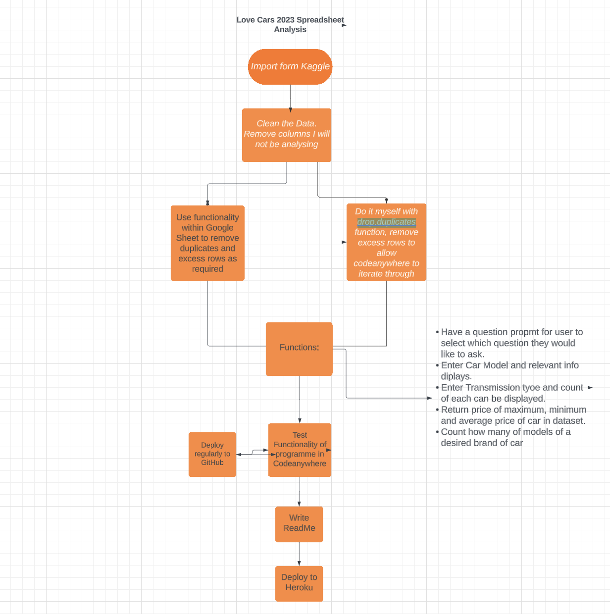

# Love Cars

This program was set up in order to analyse information provided on a Google Sheet called Love_Cars_2023. This dataset was originally imported from Kaggle. This program allows the user to pull information from the spreadsheet and finding out information such as the maximum cost of a car in this dataset, the total car sales, entering a car model and receiving information about the same car such as cost, customer rating, transmission type and so much more!
On opening this program the user is presented with a number of questions they can find out the answer to and they can select which questiom they would like to begin with. The user will be able to get the answers to all questions if they wish. 
The information displayed to the user is easily understood and organised in its format.

## Planning of Project
- I began to plan my project initially by brainstorming as to what type of project I would like to create using Python and I have a big interest in the data science and data anaylsis side of Python so I decided I would analyse a spreadsheet using Python. 
- I sourced my spreadsheet from <a href ='https://www.kaggle.com/'>Kaggle</a> as it has a vast range of datasheet that could be manipulated.
- I chose the <a href ='https://www.kaggle.com/datasets/anoopjohny/2023-cars-dataset'> 2023 Cars Dataset</a> as I do have an interets in cars and I believed I could make good use of this dataset. 
- Once I had the dataset chose I then imported the data set to Googlesheets.
- From here I laid out a plan for my project using <a href='https://www.lucidchart.com/pages/landing?utm_source=google&utm_medium=cpc&utm_campaign=_chart_en_tier1_mixed_search_brand_phrase_&km_CPC_CampaignId=1490375424&km_CPC_AdGroupID=55688907097&km_CPC_Keyword=lucid%20%2B%20app&km_CPC_MatchType=p&km_CPC_ExtensionID=&km_CPC_Network=g&km_CPC_AdPosition=&km_CPC_Creative=442433234813&km_CPC_TargetID=kwd-1642964025971&km_CPC_Country=1007880&km_CPC_Device=c&km_CPC_placement=&km_CPC_target=&gclid=Cj0KCQjwz8emBhDrARIsANNJjS6RwYy24zCQFCUOUgdm1xU7kGdINpTk-hPq88aJ0ZzMZM6RDxpHdEwaAkQ2EALw_wcB'>Lucid App</a> as can be seen. I found this very helpful as it served like a checklist to me as I progressed through my project to ensure I was doing all I needed to do. 

## Contents of Project
- Data Cleaning
- Creationg of Blueprint using Class and Instance Method
- Making Data Accessible
- Functions
- User Options and Instructions
- Libraries Imported

### Data Cleaning
- I had two options to choose from in relation to cleaning of the data in order to make it easier to manipluate and to give users the most accurate results also. I had spoken to my tutor about using the drop_duplicates() function imported through the Pandas library. I did attempt to do this however, unfortuantely it was taking too much time so I have added this as a feature I would like to extend onto when I do have more time. While attempting to do this I also found out that Codeanywhere could not iterate through more than approximately 100 lines without throws an error so in order to reduce these I used the functionality within Googlesheets to remove duplicates and to ensure the total dataset was less than 100 lines. 

### Making Data Accessible
- Following on from the advice of my tutor I decided to define variables for the rows and columns that I knew I would need access to throughout my project for ease of use within the functions I was about to create. To do this I first declared my spreadsheet as a variable and got all values from that as a starting point for all the other information. This helped immensley as data could be easily pulled in different functions as they were declared at a Global Scope meaning they could be used anywhere within the project.

### Functions 
- There were a number of functions I had thought of that would be possible for this project as I could see its potential for vast manipulation. 
    * The print_car_info function was the first function I wanted to create as I wanted the user to be able to enter a desired car model from the googlesheet and for the app to return a list of information about this specific car model. I mananged to get the car model details to print, however, they were printing in a list format which I found difficult to interpret myself. In order to imporove on this I pulled the header row to print at the same time as the row the desired car model details were in. I formatted these two rows in a dictionary format allowing for the user to easily see which information related to which heading.

    * I created the print_num_transmission_type and calculate_percentage_transmission together. I created the print_num_transmission_type as a way for the user to enter any of the transmission types on the googlesheet and to return the number of each of these that there was. However, I felt this funciton lacked substance so I wanted to expand further on this. As an extension I have added a question at the end of print_num_transmission_type asking the user which transmission type they would like to calculate the percentage of in the dataset. I calculated this by getting the length of the transmission type length, minusing 1 from the list to remove the header row. I defined each of the transmission types using the count() function to count how many times each transmission type occurs in the it's row. I divided the count of desired transmission type by the total length of transmission types and multiplied it by 100. I rounded this figure for the print funciton in order to make it look tidier for the user. 
    * The print_body_type function pulls the data from the column containing the body types in the data sheet and counts the recurrence of the desired body type the user wants to count and returns ita value within an F-String to make interpreting this information earier for the user.
    * The calculate_average_max_min_cost was my favourite to create as I really found this function got me thinkning about the vast potential of Python and all of its libraries that can be imported. From here I once again used my blueprint from the start to pull the cost column. I removed the first entry from this column as I knew it was a header, being a string and not an integer which I would eventually need to be working with. From here I created a new empty list to house the results of my for loop. I created a for loop to remove the , from the costs, i.e. 2,400 to 2400. This still resulted in the datatype of this being a list. I once again created another for loop and an empty list. This for loop converted my list of string to a list of integers in order to allow for manipulation. From here I was able to import numpy and use its functions to calculate the minimum, maximum and average car cost for the user. 
    * The car_sales_information function worked in a similar way to the above function but this function converted the minimum, maximum, average and total car sales of this data set and once again displayed results in an F-String format to allow for easier reading. I also added to this function the option for the user to return the values of all four options in this questions which I thought added to it's functionality and accessibility.
    * The counting_num_of_models_in_brand function uses a slightly different blueprint for manipulation. My desire for this function was to count how many models of a desired brand. On researching this I came across the value_counts() function [here](https://pandas.pydata.org/docs/reference/api/pandas.Series.value_counts.html) and I believed it would solve my problem. However, I needed to convert this column to be accessed by the code in order to display results to the user. To solve this I displayed the count result as a dataframe which displayed the results and could be accesed as I had read about this loc function [here](https://www.datacamp.com/cheat-sheet/pandas-cheat-sheet-for-data-science-in-python) in Data Camp and I was interested in trying it. As a result of using these the user could input whichever brand they wanted to count and a result would display the count of models of the desired brand.

- For all functions I handled invalid data using an else statement that informed the user to please input valid information and included an example of what was valid data. 

### User Options and Instructions
- In order to provide accessibility and a good user experience for the user I knew I would need to display a homescreen of sorts with options for the user to select which question they wanted to answer to as well as instructions on what to input to the console in order to get to the desired questions. This function selecting_questions displayed options to the user to select which question they wanted to find the answer to and also an option to exit the programme when they had finished. The exit_program function is triggered when the user types 'Exit' to the console and this funciton first confirms that the user wishes to end the programme, if 'Y' is entered the programme exits and if 'N' is entered the user is brought back to the homescreen. 

### Libraries Imported
- I imported Pandas and Numpy for the functions in this project and I do believe they have had a big impact in improving the functionality of my project. I had inputted the CSV library at a point when I thought I was completing the drop_duplicates() funciton as I would have needed somewhere for the new datasheet to print, unfortunately due to time constraints I did not complete this but do intend do later in time when I have more time. I imported gspread in order to be able to access my googlesheeet. I imported Credentials from google.oauth2.service_account to use my creds.json file to set up authentication needed to access my Google Cloud project created. 

## Testing

### Validator Testing
- At the time of testing and deployment I could not access the pep8 website due to an error on the website so I followed the steps on [PyPi](https://pypi.org/project/pep8/) here to import pep8 into my console and then used the command pep8 run.py to check for errors in my code and at the time of deployment none were visible.

### Accessibility Testing
- I tested my project through Chromes Lighthouse testing and I am very happy with the scores.

### Solved Bugs
* When I tested my code using PEP8 in my codeanywhere it returned many errors stating E501 line too long. I did not know how to solve this as I knew I couldn't text from a lot of lines within my code. I researched solutions to this issue and I came across a solution [here](https://peps.python.org/pep-0008/) whereby I could break lines up using a \ while still maintaining integrity of my code and functionality most importantly.
* Another bug that I solved during this project was in the counting_num_of_models_in_brand function, I dicussed this in detail above but my blueprint for the project I had originally created would not help me generate answers correctly for this function so I had to take this information from the column and remove the first entry i.e. the heading, then create two different for loops, one to remove the commas from the numbers and create a new list of those results and the next one to convery these numbers into a list of integers so that they could be analysed and worked with.

### Unsolved Bugs
* At time of deployment there are no unsolved bugs in the code.

### Features to Extend
- Overall I am very happy with my project. However, when I do have more time I would like to consider adding a library like Colorama to add colours to the font of both my questions in the terminal and in the input of the user in order to make it easier to read and interpret. 
- Also if I did have more time I would like to have removed the duplicates in my datasheet programmatically myself using the drop_duplicates function. 

### Programs Used 
- [LucidChart](https://www.lucidchart.com/pages/landing?utm_source=google&utm_medium=cpc&utm_campaign=_chart_en_tier1_mixed_search_brand_exact_&km_CPC_CampaignId=1490375427&km_CPC_AdGroupID=137488435595&km_CPC_Keyword=lucid%20app&km_CPC_MatchType=e&km_CPC_ExtensionID=&km_CPC_Network=g&km_CPC_AdPosition=&km_CPC_Creative=598116882677&km_CPC_TargetID=kwd-302739930476&km_CPC_Country=1007880&km_CPC_Device=c&km_CPC_placement=&km_CPC_target=&gclid=Cj0KCQjwz8emBhDrARIsANNJjS7kkvCgSYO-duQmZqWkt1Q0CGS9hIKJpdnfV-lDQSFyoNQVEjI7KFcaAoOmEALw_wcB) 
- [Heroku](https://www.heroku.com/home)
- [GitHub](https://github.com/)
- [Codeanywhere](https://codeanywhere.com/signin)
- [GoogleSheet](https://www.google.com/sheets/about/)

## Credits
- The spreadsheet for this app was imported from [Kaggle](https://www.kaggle.com/) and can be found [here](https://www.kaggle.com/datasets/anoopjohny/2023-cars-dataset)
- The link to the spreadsheet that I worked on for the duration of my project is [here](https://docs.google.com/spreadsheets/d/1i2zcGJxoFKk7v_tAH2Iy_3dxujUOKjPGjHLT9x9M02A/edit?usp=sharing)
- I referenced the Love Sandwiches course content to plan my project and set it up also
- I used [Datacamp](https://www.datacamp.com/) for troubleshooting my code and getting idea on how to set up functions such as [numpy](https://images.datacamp.com/image/upload/v1676302459/Marketing/Blog/Numpy_Cheat_Sheet.pdf) and [pandas](https://images.datacamp.com/image/upload/v1676302204/Marketing/Blog/Pandas_Cheat_Sheet.pdf)
- I also used [GeeksforGeeks](https://www.geeksforgeeks.org/) for solving problems I encountered also such as converting data to integeres [here](https://www.geeksforgeeks.org/python-converting-all-strings-in-list-to-integers/)
- I used [GSpread](https://docs.gspread.org/en/latest/index.html) for creating my [blueprint](https://docs.gspread.org/en/latest/user-guide.html) for making the columns and rows easy to access withing my spreadsheet.
- I would like to thank Sean and Sarah in Student Support for their help and advice.
- I would like to thank Luke Buchanan, mentor for tutoring me and helping me plan out what I would do with this project and for listening to my ideas.

## Deployment
- My project was deployed to Heroku following the steps for deployment video of the Love Sandwiches project, which are described below:
    * Open Heroku website
    * Log into account using own credentials
    * Select 'New' on the right side of page and then select 'Create New App'
    * Insert App Name - must be unique
    * Insert Region 
    * Select 'Create App'
    * From next page select 'Settings' tab
    * On next pag scroll down and select 'Reveal Config Vars'
    * In box labelled 'KEY' enter 'CREDS'
    * In the box labelled 'VALUE' copy and paste content of 'creds.json' file from codeanywhere workspace for project
    * Click 'Add'
    * In the next box labelelled 'KEY' insert 'PORT'
    * In the box labelled 'VALUE' insert 8000
    * Click 'Add'
    * Scroll down page and in section lablled 'Buildpacks' select 'Add buildpack'
    * Select box labelled 'python' and then select 'Save Changes'
    * Select 'Add buildpack' once again and select box labelled 'nodejs' and select 'Save Changes'
    * NOTE: Buildpacks must be in correct order, Python on top and Nodejs below
    * Scroll up to top of the page and select tab labelled 'Deploy'
    * In 'Deployment Method' section select 'GitHub'
    * Below select 'Connect to GitHub'
    * Search for GitHub repository name in 'repo-name' box and select 'Search' and when the name appears select 'Connect'
    * Scroll down to Manual Deploys and select 'Deploy Branch' 
    * Automatic Deploys may also be used
    * Below 'Deploy Branch' the app can be seen to be created
    * A button saying 'View' will appear when complete
    * Select View and app will open in new tab and mock terminal can be seen

